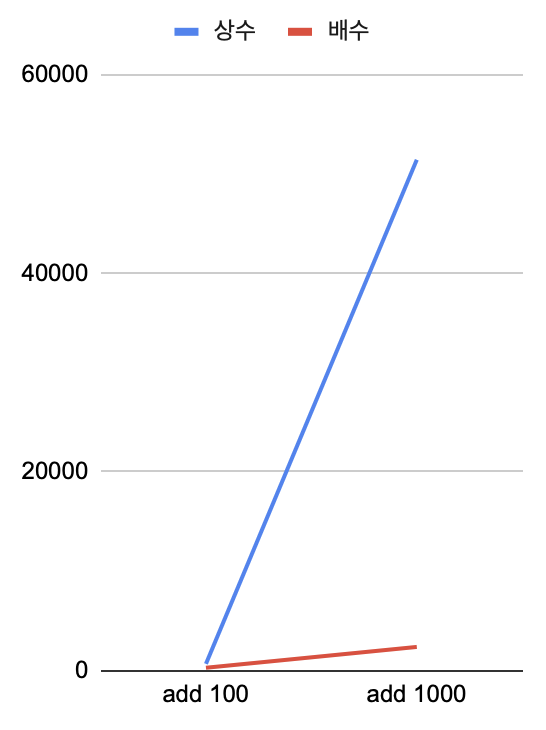

+++
date = '2026-04-02T09:32:03+09:00'
draft = false
title = 'Java ArrayList Deep Dive'
summary = '자바의 ArrayList 의 크기는 어떻게 관리되는가? 성능과 메모리 효율의 균형을 잡는 내부 크기 관리 메커니즘 분석'
tags = ['자료구조', 'Java']
+++

## ArrayList 기초 : 동적 배열 관리

### 1. 동적 배열

Java 의 **배열**의 가장 큰 한계는 **크기가 정해져 있다**는 것이다.
그래서 **크기를 스스로 관리할 수 있는 ArrayList 자료구조**가 필요하게 되었다.

```java
public void add(E element) {
    if (arr.length == size) {
        System.out.println("Extending...");
        ensureCapacity(size + 1);
    }
    // 기본적으로 기존 요소들의 끝에 추가한다. O(1)
    arr[size++] = element;
}

public void ensureCapacity(int minCapacity) {
    if (minCapacity > arr.length) {
        int newCapacity = arr.length * 2;  // 배열의 길이를 2배 확장한다.
        if (minCapacity > newCapacity) newCapacity = minCapacity;

        Object[] newArr = new Object[newCapacity];
        for (int i = 0 ; i < arr.length ; i++) {
            // 기존의 요소들을 새로운 배열로 옮긴다. O(n)
            newArr[i] = arr[i];
        }
        arr = newArr;
    }
}
```

ArrayList 에 **새로운 요소들을 넣는 경우**,
기본적으로 **기존의 요소들의 끝에 새로운 요소를 추가**하면 되기에 **O(1) 의 시간이 소요**된다.

하지만 배열의 특성상 **길이가 정해져 있기 때문**에
배열이 꽉차게 되면 새로운 배열을 생성해 요소들을 옮겨 주어야 한다.

이때 **기존의 요소들을 새로운 배열로 옮겨주는 O(n) 의 작업**이 필요하게 되는데,
**배열을 얼마나 늘릴 것인가**에 따라 **이 작업을 얼마나 자주 하게 되는지**가 정해진다.

> **비용이 큰 요소 이동 작업**을 **얼마나 자주** 할 것인가가 동적 배열의 핵심!

### 2. 동적 배열 확장 방식 두가지 : 상수 확장, 배수 확장

예를 들어 **기본 크기가 10인 배열**에 **100개의 요소를 추가**하는 경우,
+10 만큼 상수 확장을 하게 되면 **10개의 요소가 추가될 때마다** 확장을 해야한다.
하지만 x2 만큼 배수 확장을 하게 되면 **10, 20, 40, 80개의 추가마다** 확장을 진행하게 된다.

실제 값으로 단순 삽입과 요소 이동을 더해 보면
**상수 확장은 640번, 배수 확장은 246번**의 작업을 진행하게 된다.

**1000개의 요소를 추가**하는 경우는
**상수 확장은 51400번, 배수 확장은 2343번**으로,
**배수 확장**은 상수 확장에 비해 **작업량이 천천히 증가**하는 것을 알 수 있다.

> **배수 확장** 작업량은 상수 확장 작업량보다 **천천히 증가!**

배수 확장의 경우, **요소가 많이 추가 될 수록**
확장이 필요한 경우보다 **확장이 필요하지 않은 경우가 늘어나게 되고**
요소가 아주 많아지면 **확장의 비용은 무시**할 수 있게 되어
배수 확장의 경우 **add 작업의 시간 복잡도는 O(1) 이 된다.**
(**분할 상환 분석 Amortized Analysis** : 어쩌다 한번 발생하는 비용을 전체 작업으로 나눔)

<p align="center">
  
</p>

### 3. 적절한 확장 배수 찾기 : 2배와 1.5배의 차이

그렇다면 **몇배만큼 확장을 하는 것이 좋을까?**

당연히 한번 확장할 때 **크게 확장할 수록 시간 효율성은 좋아진다.**
한번에 아주 많이 확장해버리면 확장작업을 하지 않아도 되지만
**사용되지 않는 공간들은 낭비**되는 문제가 발생한다.

> 배수가 **커질수록 확장은 덜** 일어나지만, **사용하지 않는 빈공간**이 더 많아진다.

그래서 **많은 삽입**이 필요한 경우,
**ensureCapacity 메서드**를 통해서 **직접 필요한 만큼** **한번에 배열을 확장하는 것이 권장**된다.

> 공간이 얼마나 필요할지 모를 때, **어떻게 확장하는 것이 효율적**일까?

얼마나 공간이 필요한지 몰라 크기를 딱 맞출수 없다면,
**이전에 사용했던 메모리 공간을 재활용**하면 어떨까?

여기서 **2배 확장**은 이것이 불가능해진다.
2배씩 커지게 되면 **언제나 필요한 공간이 이전 공간의 합보다 크게 된다.**

```
10 (빈공간 0) -> 20 (빈공간 10) -> 40 (빈공간 30) -> 80 (빈공간 60) -> ...
```

그래서 **2배보다는 적은 배수**가 필요한데,
Java 는 시간, 공간 효율성의 균형을 **1.5배**로 선택하였다.
게다가 이 1.5배란 **빠르고 정확한 비트 연산**으로 계산이 가능하다.

```
기존 크기 + (기존 크기 >> 1)
```

> 시간 효율성과 공간 효율성의 균형, **Java 의 선택 1.5배**

---

## ArrayList 의 실제 구현

그러면 **실제로 Java 의 ArrayList 가 어떻게 구현**되는지 알아보자.
(아래의 코드들은 GraalVM 21 환경에서 확인하였다.)

### 1. 객체 생성시 동작 : 메모리를 아끼는 플라이웨이트 전략

가장 먼저 객체 생성시 동작인데,

```java
private static final Object[] DEFAULTCAPACITY_EMPTY_ELEMENTDATA = {};

public ArrayList() {
  this.elementData = DEFAULTCAPACITY_EMPTY_ELEMENTDATA;
}
```

기본적으로 ArrayList 는 **생성시 빈 배열로 초기화** 된다.
이는 객체를 생성만 하고 요소를 추가하지 않는 경우가 많다고 판단하여
처음부터 큰 길이를 주지 않음으로 더 효율적인 메모리 관리를 위함이다.

하지만 **빈 배열 역시 메모리를 점유**하기 때문에,
그리고 빈 배열은 **사용할 수 없고 확장시 버려지기** 때문에,
**매번 새롭게 빈 배열을 생성하지 않고 static 으로 미리 생성해놓은 빈 객체에 연결**하는 방식을 사용하는 것이다.

| ArrayList 생성시 | 길이 10 배열          | 길이 0 배열 | static 배열에 연결       |
| ---------------- | --------------------- | ----------- | ------------------------ |
| 할당되는 공간    | 객체, 배열, 배열 공간 | 객체, 배열  | 객체, static 배열 주소값 |

이런 **지연 할당 방식**을 사용하기 때문에
수천, 수만개의 ArrayList 객체를 만들어도 **모두 static 배열 하나**만을 가리키기 때문에 효율적이 된다.
이런 방식을 디자인 패턴으로는 싱글톤과 비슷한 **플라이웨이트 방식**이라고도 한다.

> ArrayList 는 빈 static 배열에 연결되는 **플라이웨이트 방식**으로 생성된다!

### 2. 요소의 추가와 확장 : 사용자의 의도를 존중하는 grow() 로직

그리고 **요소가 실제로 추가될 때 확장**이 일어난다.
다음은 기본적인 배열의 끝에 요소가 추가되는 경우이다.

```java
// 요소 추가
public boolean add(E e) {
  modCount++;
  add(e, elementData, size);
  return true;
}

private void add(E e, Object[] elementData, int s) {
  if (s == elementData.length)
    elementData = grow();
  elementData[s] = e;
  size = s + 1;
}

// 확장
private Object[] grow() {
  return grow(size + 1);
}

private Object[] grow(int minCapacity) {
  int oldCapacity = elementData.length;
  if (oldCapacity > 0 || elementData != DEFAULTCAPACITY_EMPTY_ELEMENTDATA) {
    int newCapacity = ArraysSupport.newLength(
      oldCapacity,
      minCapacity - oldCapacity,
      oldCapacity >> 1
    );
    return elementData = Arrays.copyOf(elementData, newCapacity);
  } else {
    return elementData = new Object[Math.max(DEFAULT_CAPACITY, minCapacity)];
  }
}
```

ArrayList 객체는 빈 배열로 초기화 되기 때문에
**첫 요소 삽입에서 반드시 확장**이 일어난다.

하지만 여기서도 두가지로 나뉘는데,
**평범하게 ArrayList 객체를 생성**했다면 elementData 에는 **DEFAULTCAPACITY_EMPTY_ELEMENTDATA 가 연결**되어 있게 되고,

```java
private static final int DEFAULT_CAPACITY = 10;

return elementData = new Object[Math.max(DEFAULT_CAPACITY, minCapacity)];
```

minCapacity (이 경우에는 1) 과 DEFAULT_CAPACITY 10 중에 큰 값인
**10으로 배열이 확장** 된다.

그런데 만약 **처음 배열을 생성할 때 길이를 0으로 굳이 설정**했다면,

```java
private static final Object[] EMPTY_ELEMENTDATA = {};

public ArrayList(int initialCapacity) {
  if (initialCapacity > 0) {
    this.elementData = new Object[initialCapacity];
  } else if (initialCapacity == 0) {
    this.elementData = EMPTY_ELEMENTDATA;  // 길이를 0으로 설정
  } else {
    throw new IllegalArgumentException("Illegal Capacity: " + initialCapacity);
  }
}
```

이전의 DEFAULTCAPACITY_EMPTY_ELEMENTDATA 가 아니라
**EMPTY_ELEMENTDATA 가 연결**이 된다.

그리고 사용자가 **굳이 0으로 길이를 설정**한 것은 **메모리를 극도로 아끼려는 사용자의 신호**로 생각하기 때문에,
elementData != DEFAULTCAPACITY_EMPTY_ELEMENTDATA 조건에 의해

```java
int newCapacity = ArraysSupport.newLength(
  oldCapacity,                  // 0
  minCapacity - oldCapacity,    // 1 - 0 = 1
  oldCapacity >> 1              // 0 / 2 = 0
);

// ArraysSupport.newLength -> return oldLength + Math.max(minGrowth, prefGrowth);
// 그러니까 newCapacity = 0 + 1 = 1

return elementData = Arrays.copyOf(elementData, newCapacity);
```

크기가 10으로 확장되지 않고 **최소한인 1로 확장**되게 된다.

### 3. 요소 중간 삽입 : O(n) 의 물리적 한계

그렇다면 **배열의 중간에 요소를 추가**할 때는 어떨까?

```java
public void add(int index, E element) {
  rangeCheckForAdd(index);
  modCount++;
  final int s;
  Object[] elementData;
  if ((s = size) == (elementData = this.elementData).length)
    elementData = grow();
  System.arraycopy(elementData, index, elementData, index + 1, s - index);
  elementData[index] = element;
  size = s + 1;
}
```

배열의 끝 추가 방식과 마찬가지로 확장이 필요하다면 **배열 확장을 진행**하고,
**인덱스부터 끝까지 요소들을 뒤로 한칸 밀고 해당 요소를 추가**한다.

요소들을 옮길 때 **System.arraycopy 메서드**를 사용하는데
이 메서드는 네이티브로 구현되어 OS 레벨에서 **메모리 블록을 통째로 복사하여 옆으로** 옮기는 방법으로 for 보다 훨씬 빠르다.

그렇지만 **삽입 위치 이후의 모든 요소들을 한칸씩 이동**해야 하기 때문에,
ArrayList 는 **중간 삽입 (혹은 삭제) 에 상대적으로 취약**하다.
(**시간 복잡도 O(n)**)

> ArrayList 의 중간 요소 삽입 및 삭제의 시간 복잡도는 O(n)!

### 4. 데이터의 일관성을 지키는 modCount

추가로 **요소 삽입 등의 작업이 수행**될 때,
**modCount 라는 변수의 값이 하나씩 증가**한다.

```java
public boolean add(E e) {
  modCount++;
  add(e, elementData, size);
  return true;
}
```

이는 **반복문이나 멀티스레드 환경**에서 **배열이 변경되었는지** 확인하는 부분이다.

```java
final void checkForComodification() {
  if (modCount != expectedModCount)
    throw new ConcurrentModificationException();
}
```

이런 식으로 확인하는데,
작업이 시작될 때의 modCount 를 **expectedModCount 에 저장**하고,
작업 중간 중간 **현재의 modCount 와 expectedModCount 가 다르다면 오류**를 반환한다.

이는 자바 프레임워크의 **Fail-Fast 전략**을 보여주는 경우인데,
**배열이 중간에 변형**되면 **데이터의 일관성이 깨지고,**
작업을 계속하여 **예측 불가능한 버그가 생길바에는 수정 즉시 오류를 반환한다**는 것이다.

그래서 **루프 안에서 리스트를 직접 수정하는 것은 위험**하고
필요하다면 다른 방법을 사용해야 한다.

---

## 마치며 : ArrayList 의 시간복잡도와 개발자의 책임감

### 1. 각 작업별 시간복잡도

ArrayList 의 **각 작업별 시간 복잡도**를 비교해보면,

| 작업                     | 시간복잡도 | 특징                              |
| ------------------------ | ---------- | --------------------------------- |
| 조회 (get)               | O(1)       | 내부 배열의 인덱스 접근으로 빠름  |
| 검색 (contains)          | O(n)       | 배열 전체를 확인해야 함           |
| 끝에 추가 (add)          | O(1)       | 분할 상환 분석에 의해 상수 시간   |
| 중간 삽입, 삭제 (remove) | O(n)       | 인덱스 뒤의 요소를 전부 옮겨야 함 |

그러므로 ArrayList 는 **끝에서 추가와 삭제**가 일어나고,
**인덱스로 요소를 찾아야 하는 경우** 유리하다.

**중간 삽입과 삭제가 빈번한 경우에는 다른 자료구조**를 사용하는 것이 더 좋다.

### 2. 개발자의 책임감

**배열**을 사용할 때 가장 신경써야 하는 부분은 **배열의 크기를 관리**하는 것이다.
그리고 **ArrayList** 는 이를 간편하게 해준다.

하지만 그렇다고 해서 **개발자가 아무것도 안해도 되는 것은 아니다.**

대량 삽입시 **들어갈 데이터의 양을 예상**해서 **생성시 크기를 설정**하여
불필요한 grow 연산을 줄인다면 **삽입 성능을 크게 개선**할 수 있다.

그리고 **반복문 중간에 요소를 추가, 삭제**하지 않도록 주의하고
다른 자료구조를 사용하거나 **수정할 대상을 모았다가 한번에 처리**하는 방식을 택해야 한다.

이처럼 **자료구조마다 다른 각각의 특성을 잘 이해하고 기억**한다면
**가장 효율적인 방식으로 사용**할 수 있을 것이다.
