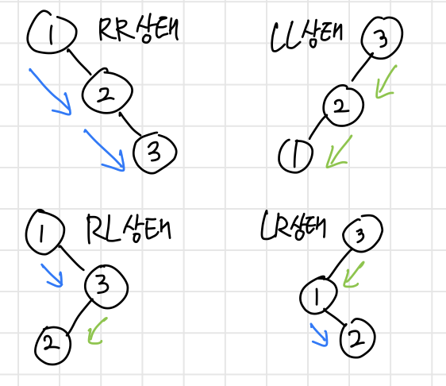
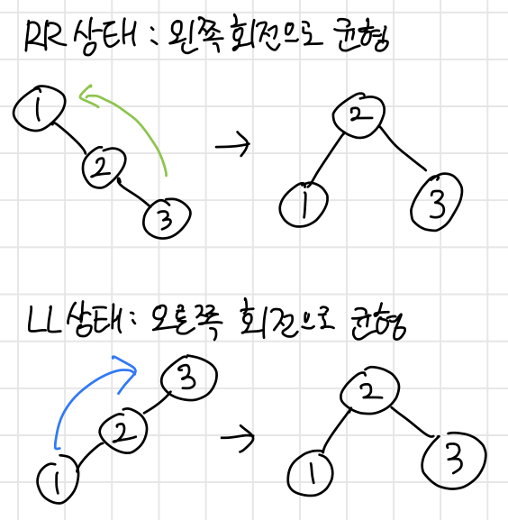

+++
date = '2026-04-10T14:11:37+09:00'
draft = false
title = 'AVL 트리 직접 구현 과정'
summary = 'AVL 트리의 원리와 실제 구현, BST 와 성능 비교 측정'
tags = ['과정', '자료구조', 'Java']
+++

## 1) AVL Tree 이론

### 1-1) AVL 트리의 개념 : Balance Factor 와 회전

**AVL 트리**는 Adelson-Velsky & Landis 트리로,
왼쪽에서 오른쪽 서브트리의 높이를 뺀 **Balance Factor (BF) 를 사용**한다.

언제나 모든 노드에서 **BF 는 -1, 0, 1 중 하나**여야만 한다.

0 = **양쪽 높이 동일**
양수 = **왼쪽이 더 깊음**
음수 = **오른쪽이 더 깊음**

BF 의 **절댓값이 1을 넘을 수 없다**는 것은
AVL 트리에서 노드의 **양쪽 서브트리의 높이 차이는 1 까지만 허용**된다는 것이다.

그래서 왼쪽 서브트리가 더 깊으면 오른쪽으로,
오른쪽 서브트리가 더 깊으면 왼쪽으로 **회전하는 방식으로 균형**을 맞춘다.

### 1-2) 4가지 불균형 상태와 회전을 통한 균형 맞추기

불균형 상태는 4가지로 나눌 수 있는데,
**RR, LL, RL, LR** 로 분류한다.



첫번째 문자는 **현재 노드에서 무거운쪽**, 두번째 문자는 **자녀 노드에서 무거운 쪽**을 의미한다.
(RL -> 현재 노드에서 오른쪽, 왼쪽으로 무거움)

AVL 트리는 이 불균형을 해결하기 위해,
먼저 **RL, LR 상태**에서는 왼쪽과 오른쪽 회전을 통해 **RR, LL 상태로** 만들고,


RR 과 LL 상태는 **왼쪽과 오른쪽 회전**을 통해 **균형 상태**로 만든다.



이 작업을 노드가 추가되고 삭제될 때마다 **재귀적으로 진행**하여
**트리의 높이를 낮춤**으로
AVL 트리는 **효율성을 스스로 유지**한다.

---

## 2) AVL Tree 구현

### 2-1) 회전 메서드 두가지

회전 메서드는 **부모 노드를 인자**로 받아서 진행한다.

```java
// 2-1-1) 왼쪽 회전
Node leftRotate(Node parent) {
  Node node = parent.right;
  Node left = node.left;

  // 부모노드를 노드의 왼쪽으로 내림
  node.left = parent;
  parent.right = left;  // 기존 왼쪽 노드는 부모노드 오른쪽으로

  // 높이 재계산 - 하위노드(이전 부모노드) 먼저 계산
  parent.height = Math.max(getHeight(parent.left), getHeight(parent.right)) + 1;
  node.height = Math.max(getHeight(node.left), getHeight(node.right)) + 1;

  // 새로운 서브트리 루트가 된 노드 반환
  return node;
}

// 2-1-2) 오른쪽 회전
Node rightRotate(Node parent) {
  Node node = parent.left;
  Node right = node.right;

  // 부모노드를 노드의 오른쪽으로 내림
  node.right = parent;
  parent.left = right;  // 기존 오른쪽 노드는 부모노드 왼쪽으로

  // 높이 재계산 - 하위노드(이전 부모노드) 먼저 계산
  parent.height = Math.max(getHeight(parent.left), getHeight(parent.right)) + 1;
  node.height = Math.max(getHeight(node.left), getHeight(node.right)) + 1;

  // 새로운 서브트리 루트가 된 노드 반환
  return node;
}
```

### 2-2) Balance Factor 및 Rebalance 로직

**현재 노드의 균형 상황**을 알기 위한 getBalance 메서드와
**4가지 불균형 상태를 해결**하는 rebalance 메서드

```java
int getBalance(Node node) {
  if (node == null) return 0;
  return getHeight(node.left) - getHeight(node.right);
}

Node rebalance(Node node) {
  int bf = getBalance(node);

  if (bf < -1) {
    // BF 가 -1 보다 작은 경우 => 오른쪽이 더 무거움

    // 자녀 노드의 BF 는 0 보다 큰 경우 => 왼쪽이 더 무거운 RL 상태
    // 오른쪽 회전으로 RR 상태로 만듦
    if (getBalance(node.right) > 0) node.right = rightRotate(node.right);

    // RR 상태에서 왼쪽 회전으로 균형
    node = leftRotate(node);

  } else if (bf > 1) {
    // BF 가 1 보다 큰 경우 => 왼쪽이 더 무거움

    // 자녀 노드의 BF 는 0 보다 작은 경우 => 오른쪽이 더 무거운 LR 상태
    // 왼쪽 회전으로 LL 상태로 만듦
    if (getBalance(node.left) < 0) node.left = leftRotate(node.left);

    // LL 상태에서 오른쪽 회전으로 균형
    node = rightRotate(node);
  }

  return node;
}
```

### 2-3) insertNode 와 deleteNode 오버라이딩

```java
@Override
protected Node insertNode(Node node, int value) {
    if (node == null) return new Node(value);

    if (node.value < value) {
        node.right = insertNode(node.right, value);
    } else if (node.value > value) {
        node.left = insertNode(node.left, value);
    }

    // ----------------------------
    // 여기까지 기존 삽입과 같음
    // 삽입 후 높이 새로 계산
    node.height = Math.max(getHeight(node.left), getHeight(node.right)) + 1;

    // 균형 확인 (재귀로 동작)
    return rebalance(node);
}

@Override
protected Node deleteNode(Node node, int value) {
  if (node == null) return null;

  if (node.value < value) {
    node.right = deleteNode(node.right, value);
  } else if (node.value > value) {
    node.left = deleteNode(node.left, value);
  } else {
    if (node.right == null || node.left == null) {
      node = (node.left == null) ? node.right : node.left;
    } else {
      Node successor = getRightMin(node.right);
      node.value = successor.value;
      node.right = deleteNode(node.right, successor.value);
    }
  }

  if (node == null) return null;

  // ----------------------------
  // 여기까지 기존 삽입과 같음
  // 삽입 후 높이 새로 계산
  node.height = Math.max(getHeight(node.left), getHeight(node.right)) + 1;

  // 균형 확인 (재귀로 동작)
  return rebalance(node);
}
```

### 2-4) BST 와 비교 결과

이론상 **AVL 트리**는 삽입되는 요소의 정렬과 상관없이
이진 탐색 트리를 꽉 채우며 동작하기 때문에 **log n 의 높이를 보장**한다.
(시간 복잡도가 언제나 O(log n) 이라는 것과 같음)

```java
BST2 bst = new BST2();
AVLT avlt = new AVLT();

for (int i = 0; i < 1000 ; i++) {
  bst.insert(i);
  avlt.insert(i);
}

System.out.println("요소 1,000개 삽입");
System.out.println("BST height : " + bst.getHeight());
System.out.println("AVLT height : " + avlt.getHeight());
```

이전의 BST 와 **정렬된 요소가 삽입**되는 경우를 비교해보았다.

```
요소 1,000개 삽입
BST height : 1000
AVLT height : 10
```

정렬된 요소가 삽입되었을 때
**BST 는 연결 리스트**가 되어 트리의 높이가 바로 늘어나
O(log n) 에서 **O(n) 으로 시간 복잡도가 증가**하게 된다.

하지만** AVL 트리**의 높이는
$$\log_{2} 10 \approx9.9$$
**에 가까운 10**으로
**O(log n) 의 시간 복잡도를 유지**하였다.

### 2-5) 요소가 많아질 때 AVT 의 효과

**요소가 더 많아지면** 어떻게 될까?

실제로 요소가 **10배, 100배, 1000배** 늘어날 때,
**BST 는 재귀가 바로 바로 깊어지며 StackOverflow** 를 냈지만
**AVLT 는 트리의 높이를 낮게 유지**하며 **log n 의 성능을 유지**하는 것을 볼 수 있었다.

```
요소 10,000개 삽입
BST height : 10000
AVLT height : 14

요소 100,000개 삽입
BST height : 100,000 (예상) - StackOverflow
AVLT height : 17

요소 1,000,000개 삽입
BST height : 1,000,000 (예상) - StackOverflow
AVLT height : 20
```

---

## 3) AVL Tree 의 한계

하지만 AVL 트리는 **실무에서 사용되지 않는데,**

**트리의 높이를 낮추어 탐색 작업에는 아주 효과적**이지만,
모든 삽입과 삭제마다 **연관된 노드들이 회전**하며 **너무 많은 작업**이 이루어지기 때문이다.

그래서 실제 **자바의 TreeMap** 같은 자료구조에는
트리 높이는 조금 비효율적이 되더라도
삽입과 삭제 작업까지 **더 효율적으로 동작하는 Red-Black Tree** 가 사용되게 된다.
