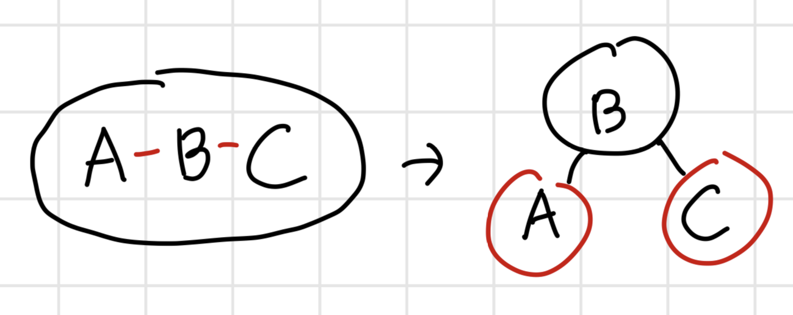

+++
date = '2026-04-11T19:57:25+09:00'
draft = false
title = '레드-블랙 트리 직접 구현 과정'
summary = '레드-블랙 트리의 원리와 삽입 구현, 실용성'
tags = ['과정', '자료구조', 'Java']
+++

## 1) 이진 탐색 트리부터 레드-블랙 트리까지

### 1-1) 이진 탐색 트리 (BST) 의 문제점 1 : 기울어진 트리

> 스스로 회전해 높이를 낮추는 **AVL 트리**

BST 에는 치명적인 문제가 있다.
**정렬된 데이터**가 들어오면 트리가 **한쪽으로 기울어져** 선형 구조가 되어
아주 비효율적이 (**시간복잡도 O(n)**) 된다는 것이다.

그래서 **트리 스스로 균형**을 잡을 수 있도록
**'회전'의 개념**을 도입해 **서브 트리 양쪽의 높이를 일정하게** 함으로
트리의 높이를 낮추는 **AVL 트리**가 등장하게 되었다.

### 1-2) 이진 탐색 트리 (BST) 의 문제점 2 : 너무 많은 노드

> 한 노드에 여러 데이터를 넣어 높이를 낮추는 **B-트리**

BST 는 여러번의 노드 비교 작업을 통해 조회가 빠르지만 **개별 노드를 접근하는 횟수가 많다.**

그래서 발생하는 두번째 문제는,
**디스크 환경**에서는 이 **메모리 접근 비용이 커져** 전체 작업의 속도가 느려지게 된다는 것이다.

그래서 **메모리 접근을 줄이기 위해**
**한 노드에 여러 데이터**를 넣어서 물리적으로 접근 횟수와
트리의 높이를 낮추는 **B-Tree** 들이 등장하게 되었다.

### 1-3) 레드-블랙 트리 (RBT) 의 등장

> 회전과 색상 변경을 이용해 높이를 낮추는 **레드-블랙 트리**

하지만 이 두가지 모두 추가적인 문제점이 있는데,

**AVL 트리**는 균형을 정밀하게 맞추기 위해서 데이터가 삽입/삭제 될 때
**많은 회전**을 통해 **전체적인 성능이 낮아진다**는 것이고,

**B-Tree** 는 **한 노드에 데이터가 여러개**가 들어있기 때문에,
**자료구조가 복잡**해진다는 것이다.

그래서 B-Tree 의 일종인 **2-3-4 트리**를
상대적으로 **단순한 이진 트리로 구현**하려는 노력이 있었고 (이진 B-트리)

이 개념이 확장되어, **노드 색과 회전**을 사용하여
**균형을 유지**하되 **너무 많은 회전은 일어나지 않는** RBT 가 탄생하게 되었다.

---

## 2) RBT 의 5가지 규칙

### 2-1) 모든 노드는 레드 아니면 블랙이다.

**2-3-4 트리의 노드**에는 **데이터가 최대 3개**까지 들어갈 수 있다.

이를 이진 트리로 표현하는 과정에서,
**기존 노드와 연결된 노드**를 **빨간 선**으로 표시하게 되었고,
**블랙 노드**와 **레드 노드**가 생겨나게 되었다.



### 2-2) 루트 노드는 블랙이다.

레드 노드는 블랙 노드에 연결된 종속적인 개념이기 때문에,
**독립적인 루트 노드**는 **반드시 블랙 노드**일 수 밖에 없다.

### 2-3) 모든 NIL 노드는 블랙이다.

**모든 리프 노드**에는 **양쪽에 빈 null 노드**가 있다고 가정한다.
그리고 이 빈 null 노드는 **블랙 노드**이다.

혹은 **null 은 블랙 노드로 처리**한다.

### 2-4) 레드 노드의 자식은 레드 노드일 수 없다.

2-3-4 트리 노드에 데이터가 3개 있는 것을
레드-블랙-레드로 표현할 수 있다.

그러므로 **레드 노드에** 자녀 노드로 **레드 노드가** 붙는다는 것은
**데이터가 4개 이상**으로 늘어나는 것을 의미하기 때문에
반드시 레드 노드는 연속해서 (**더블 레드**) 올 수 없다.

### 2-5) 임의의 한 노드에서 NIL 노드까지 도달하는 모든 경로의 블랙 노드 수는 같다.

**2-3-4 트리**는 **트리의 높이**를 모든 서브트리에서 **일정하게 유지**한다.

레드 노드는 블랙 노드에 붙은 데이터 노드기 때문에
**2-3-4 트리의 높이**와 같은 개념이 **블랙 노드의 수**이다.

RBT 는 이 **블랙 노드의 수를 관리**함으로
**트리의 높이를 간접적으로 관리**한다.

---

## 3) RBT 삽입 직접 구현 : 규칙의 적용

RBT 는 AVL 트리와 코드 상 유사한 부분이 많아
다른 부분만 정리한다.



### 3-1) 내부 노드 클래스

일반적인 이진 탐색 트리의 노드와 비교하여
**부모 포인터**와 **색깔 필드**가 추가된다.

```java
private static class Node {
  private int value;
  private Node left, right, parent;  // 부모 포인터
  private Color color;  // 색깔 필드
}
```

### 3-2) 헬퍼들

**NPE 문제 해결**을 위해 정의한 헬퍼 메서드들이다.

```java
private Node parentOf(Node x) {
  return x == null ? null : x.parent;
}

private Node leftOf(Node x) {
  return x == null ? null : x.left;
}

private Node rightOf(Node x) {
  return x == null ? null : x.right;
}

private Color colorOf(Node x) {
  return x == null ? Color.BLACK : x.color;
}
```

### 3-3) 삽입 로직 흐름

노드를 삽입하며 재귀적으로 모든 균형을 점검하는 AVL 트리와 달리
RBT 는 **노드 삽입이 완료**된 후 **트리를 점검**한다.

```java
public void insert(int value) {
  Node newNode = bstInsert(value);  // 삽입 완료
  if (newNode == null) return;
  fix(newNode);  // 트리 점검
}
```

### 3-4) RBT 핵심 : fix 메서드

노드를 삽입한 후 RBT 는 트리의 균형을 점검한다.

**새로 삽입된 노드는 레드 노드**기 때문에
**부모 노드도 레드 노드**인지 점검하는 과정을 거친다.

이때 **더블 레드** 상황이라면 트리의 균형을 맞춰야 하는데,
노드를 삽입할 때는 **삼촌 노드의 색을 확인**한다.

삼촌 노드가 **레드 노드**면,
**양쪽 서브 트리의 높이가 비슷**하다고 (**블랙 높이가 유지**되고 있다고) 판단해
**회전 없이** 조부모의 블랙을 부모 세대로 넘기는 것으로 **버티고**
레드 노드가 된 조부모부터 더블 레드를 **다시 체크**한다.

하지만 삼촌 노드가 **블랙 노드**면,
**우리 쪽 서브트리가 길어지는 상황**으로 판단해
**회전하여 균형**을 맞추고 **규칙에 맞게 노드 색을 변경**하고 종료한다.

```java
private void fix(Node node) {
  // 더블 레드 상황만 점검
  while (colorOf(parentOf(node)) == Color.RED) {
    Node uncle = leftOf(parentOf(parentOf(node))) == parentOf(node)
    ? rightOf(parentOf(parentOf(node)))
    : leftOf(parentOf(parentOf(node)));

    // 삼촌 노드가 레드 노드인 경우 색상 변경만
    if (colorOf(uncle) == Color.RED) {
      parentOf(node).color = Color.BLACK;
      uncle.color = Color.BLACK;
      parentOf(parentOf(node)).color = Color.RED;
      // 전파
      node = parentOf(parentOf(node));
    }
    // 삼촌 노드가 블랙 노드인 경우 회전 및 색상변경
    else {
      if (leftOf(parentOf(parentOf(node))) == parentOf(node)) {
        // L
        if (rightOf(parentOf(node)) == node) {
          // LR
          leftRotate(parentOf(node));
        }
        // LL
        parentOf(parentOf(node)).color = Color.RED;
        parentOf(node).color = Color.BLACK;
        rightRotate(parentOf(parentOf(node)));
      } else {
        // R
        if (leftOf(parentOf(node)) == node) {
          // RL
          rightRotate(parentOf(node));
        }
        // RR
        parentOf(parentOf(node)).color = Color.RED;
        parentOf(node).color = Color.BLACK;
        leftRotate(parentOf(parentOf(node)));
      }
    }
  }

  // 루트 노드는 블랙 노드로 유지
  root.color = Color.BLACK;
}
```

---

## 4) RBT 의 활용

이렇게 RBT 는 **부모 노드가 블랙**이거나 **삼촌 노드가 레드**인 상황에
**불균형을 해결하지 않고 어느정도 버티며 넘어가는 것**으로
AVL 트리보다 **적은 수의 회전**으로 **트리의 높이를 낮추고 균형을 유지**한다.

(AVL 트리는 **전체 높이**를 직접 맞추지만,
RBT는 **블랙 높이**만 관리하면서 전체 높이를 간접적으로 제한하는 것)

그래서 실무에서 사용되는 **TreeMap 등을 비롯한 자료구조**에서는
**레드-블랙 트리가 자주 사용**된다.

---

## 5) 전체 코드



    
    ```java
    enum Color { RED, BLACK }

    public class RBT {
      private static class Node {
        private int value;
        private Node left, right, parent;
        private Color color;

        private Node(int value) {
          this.value = value;
          this.color = Color.RED;
        }
      }

      private Node root;

      private Node parentOf(Node x) {
        return x == null ? null : x.parent;
      }

      private Node leftOf(Node x) {
        return x == null ? null : x.left;
      }

      private Node rightOf(Node x) {
        return x == null ? null : x.right;
      }

      private Color colorOf(Node x) {
        return x == null ? Color.BLACK : x.color;
      }

      public void insert(int value) {
        Node newNode = bstInsert(value);
        if (newNode == null) return;
        fix(newNode);
      }

      private Node bstInsert(int value) {
        if (root == null) {
          root = new Node(value);
          return root;
        } else {
          return insertNode(root, value);
        }
      }

      private Node insertNode(Node node, int value) {
        Node newNode = null;

        if (value > node.value) {
          if (node.right == null) {
            newNode = new Node(value);
            node.right = newNode;
            newNode.parent = node;
          } else {
            newNode = insertNode(node.right, value);
          }
        } else if (value < node.value) {
            if (node.left == null) {
              newNode = new Node(value);
              node.left = newNode;
              newNode.parent = node;
            } else {
              newNode = insertNode(node.left, value);
            }
        }
        return newNode;
      }

      private void leftRotate(Node parent) {
        Node child = parent.right;
        Node left = child.left;

        child.left = parent;
        child.parent = parent.parent;
        if (parent.parent != null) {
          if (parent == parent.parent.left) {
            parent.parent.left = child;
          } else {
            parent.parent.right = child;
          }
        }
        parent.parent = child;
        if (parent == root) root = child;

        parent.right = left;
        if (left != null) left.parent = parent;
      }

      private void rightRotate(Node node) {
        Node child = node.left;
        Node right = child.right;

        child.right = node;
        child.parent = node.parent;
        if (node.parent != null) {
          if (node == node.parent.left) {
            node.parent.left = child;
          } else {
            node.parent.right = child;
          }
        }
        node.parent = child;
        if (node == root) root = child;

        node.left = right;
        if (right != null) right.parent = node;
      }

      private void fix(Node node) {
        while (colorOf(parentOf(node)) == Color.RED) {
          Node uncle = leftOf(parentOf(parentOf(node))) == parentOf(node)
          ? rightOf(parentOf(parentOf(node)))
          : leftOf(parentOf(parentOf(node)));

          // 삼촌 노드가 레드 노드인 경우 색상 변경만
          if (colorOf(uncle) == Color.RED) {
            parentOf(node).color = Color.BLACK;
            uncle.color = Color.BLACK;
            parentOf(parentOf(node)).color = Color.RED;
            // 전파
            node = parentOf(parentOf(node));
          }
          // 삼촌 노드가 블랙 노드인 경우 회전 및 색상변경
          else {
            if (leftOf(parentOf(parentOf(node))) == parentOf(node)) {
              // L
              if (rightOf(parentOf(node)) == node) {
                // LR
                leftRotate(parentOf(node));
              }
              // LL
              parentOf(parentOf(node)).color = Color.RED;
              parentOf(node).color = Color.BLACK;
              rightRotate(parentOf(parentOf(node)));
            } else {
              // R
              if (leftOf(parentOf(node)) == node) {
                // RL
                rightRotate(parentOf(node));
              }
              // RR
              parentOf(parentOf(node)).color = Color.RED;
              parentOf(node).color = Color.BLACK;
              leftRotate(parentOf(parentOf(node)));
            }
          }
        }

        // 루트 노드는 블랙 노드로 유지
        root.color = Color.BLACK;
      }
    }
    ```
    


